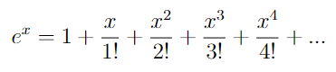
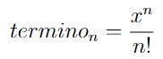

# PC1: Práctica Calificada
**Curso:** Programación II  
**unit:** 1 y 2  
**cmake project:** prog2_pc1_lab106_v2022_2

## Indicaciones Específicas
- El tiempo límite para la evaluación es 100 minutos.
- Cada pregunta deberá ser respondida en un archivo fuente (`.cpp`) y un archivo cabecera (`.h`) con el número de la pregunta:
    - `p1.cpp, p1.h`
    - `p2.cpp, p2.h`
    - `p3.cpp, p3.h`
- Deberás subir estos archivos directamente a [www.gradescope.com](https://www.gradescope.com) o se puede crear un `.zip` que contenga todos ellos y subirlo.

## Competencias
- Para los alumnos de la carrera de Ciencia de la Computación
    - Aplica conocimientos de computación apropiados para la solución de problemas definidos y sus requerimientos en la disciplina del programa.(nivel 2)
    - Diseña, implementa y evalúa soluciones a problemas complejos de computación.(nivel 2)
    - Crea, selecciona, adapta y aplica técnicas, recursos y herramientas modernas para la práctica de la computación y comprende sus limitaciones.(nivel 2)

- Para los alumnos de las carreras de Ingeniería
    - Capacidad para aplicar conocimientos de matemática.(nivel 2)
    - Capacidad para diseñar un sistema, un componente o un proceso para satisfacer las necesidades deseadas dentro de restricciones realistas(nivel 2)

### Pregunta # 1 - Máxima longitud del dígito repetido (7 points)

Dado un número entero de cualquier dimension, escribir un programa que permita ubicar la secuencia más larga de un determinado dígito, de modo que el programa devuelva la longitud de esa secuencia.

**Ejemplo #1:** Dado el número: `0111000010110000111110`, y el dígito a buscar es `1`, el número contiene las siguientes secuencias de 1’s: `111, 1, 11, 11111`  
La secuencia más larga es `11111` por tanto, el programa deberá retornar 5.

**Ejemplo #2:** Dado el número: `012133333413330113333339223`, y el dígito a buscar es `3`, el número contiene las siguientes secuencias de 3’s: `33333, 333, 333333, 3`  
La secuencia más larga es `333333` por tanto, el programa deberá retornar 6.

**Ejemplo #3:** Dado el número: `01144411413110444`, y el dígito a buscar es `7`, el número no contiene secuencias de 7’s. 
En consecuencia, el programa deberá retornar 0.  

**Use Case #1:**
```cpp
0111000010110000111110
1
```
**Output:**
```cpp
5
```
**Use Case #2:**
```cpp
012133333413330113333339223
3
```
**Output:**
```cpp
6
```
**Use Case #3:**
```cpp
01111111111110233
7
```
**Output:**
```cpp
0
```

### Pregunta # 2 - Cálculo de exponenciales (6 points)
Desarrollar la función `exponencial` que permita calcular el exponencial de un número utilizando la siguiente ecuación:  


Continuar la ejecución de la sumatoria mientras: `termino n > 0`.  


**Declaración de la función:**
```cpp
long double exponential(double x);
```
**NOTA:** NO SERA CONSIDERADA respuesta válida si se usa de la función `exp` de la librería `<cmath>`.  

**Use Case #1:**
```cpp
cout << fixed << setprecision(5);
cout << exponential(0) << endl;
```
**Output:**
```cpp
1
```
**Use Case #2:**
```cpp
cout << fixed << setprecision(5);
cout << exponential(1) << endl;
```
**Output:**
```cpp
2.71828
```
**Use Case #3:**
```cpp
cout << fixed << setprecision(5);
cout << exponential(14) << endl;
```
**Output:**
```cpp
1202604.28416
```
**Use Case #4:**
```cpp
cout << fixed << setprecision(5);
cout << exponential(23) << endl;
```
**Output:**
```cpp
9744803446.24890
```

### Pregunta # 3 - Distancia promedio (7 points)

Escribir la función `calculate_average_distance` que reciba como parámetros un arreglo de `doubles` y la dimensión del arreglo y que calcule el promedio de las `distancias absolutas` entre 2 valores consecutivos del arreglo.

La `distancia absoluta` entre dos valores es igual al valor absoluto de la diferencia de los 2 valores:
```cpp
distancia=fabs(x-y);
```
**Declaración de la función:**
```cpp
double calculate_average_distance(double* arr, int sz);
```

**Ejemplo #1:** Dado el arreglo: `double arr[4] = {-2, 2, 4, -5}`, las distancias entre los dígitos es la siguiente:  
```cpp
entre -2 y  2 la distancia es 4=fabs(-2-2)
entre  2 y  4 la distancia es 2=fabs( 4-2)
entre  4 y -5 la distancia es 9=fabs(-5-4)
```
Por tanto, la suma de distancias es 15 y el promedio es 5. 

**Use Case #1:**
```cpp
const int sz = 4;
double arr[sz] = {-2, 2, 4, -5};
cout << fixed << setprecision(1);
cout << calculate_average_distance(arr, sz) << endl;
```
**Output:**
```cpp
5
```
**Use Case #2:**
```cpp
const int sz = 7;
double arr[sz] = {2, 4, 6, 8, 10, 12, 14};
cout << fixed << setprecision(1);
cout << calculate_average_distance(arr, sz) << endl;
```
**Output:**
```cpp
2
```
